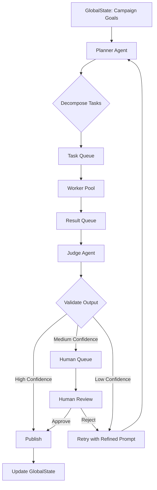

# Domain Architecture Strategy

## 1. Agent Pattern Selection

### Recommended Pattern: **Hierarchical Swarm with FastRender**

**Why Hierarchical Swarm over other patterns?**

| Pattern | Pros | Cons | Verdict |
|---------|------|------|---------|
| **Hierarchical Swarm** | Clear roles, scalable, fault-tolerant | More complex coordination | ✅ **Selected** |
| Sequential Chain | Simple, linear | Single point of failure | ❌ Rejected |
| Peer-to-Peer | Decentralized | Consensus overhead | ❌ Rejected |
| Single Agent | Simple | Not scalable, hallucination risk | ❌ Rejected |

**FastRender Pattern Components**:
```
                    ┌─────────────────┐
                    │    PLANNER      │  ← Strategic thinking
                    │  (The Strategist)│   - Decomposes goals
                    └────────┬────────┘
                             │
              ┌──────────────┼──────────────┐
              ▼              ▼              ▼
         ┌─────────┐   ┌─────────┐   ┌─────────┐
         │ WORKER  │   │ WORKER  │   │ WORKER  │  ← Execution
         │ #1      │   │ #2      │   │ #n      │   - Stateless
         └────┬────┘   └────┬────┘   └────┬────┘   - Parallelizable
              │              │              │
              └──────────────┼──────────────┘
                             │
                    ┌────────▼────────┐
                    │     JUDGE       │  ← Quality Control
                    │   (The Gatekeeper)│ - Validates output
                    └─────────────────┘   - Human escalation
```

---

## 2. Human-in-the-Loop (HITL) Placement

### Where does the human approve content?

**Safety Layer Architecture**:

```
High Confidence (>0.90)
        │
        ├──→ AUTO-APPROVE ──→ Publish
        │
Medium Confidence (0.70-0.90)
        │
        ├──→ ASYNC QUEUE ──→ Human Review Dashboard
        │                        │
        │                   Approve/Reject
        │                        │
        └──→ RETRY ──────────────►
        
Low Confidence (<0.70)
        │
        ├──→ AUTO-RETRY (with refined prompt)
        │
        └──→ ESCALATE (if retry fails 3x)
```

**HITL Decision Points**:
1. **Content Publishing**: All posts with confidence < 0.90
2. **Financial Transactions**: All transactions (CFO Judge approval)
3. **Sensitive Topics**: Politics, health, finance, legal topics (mandatory)
4. **Agent Identity Questions**: "Are you a robot?" (Honesty directive)

---

## 3. Database Selection: SQL vs NoSQL

### Recommended: **Hybrid Approach**

| Data Type | Storage | Rationale |
|-----------|---------|-----------|
| **User/Campaign Data** | PostgreSQL | ACID compliance, complex queries, relational data |
| **Agent Memories** | Weaviate (Vector DB) | Semantic search, RAG capability |
| **Task Queue** | Redis | High-velocity, low-latency, pub/sub |
| **Financial Ledger** | PostgreSQL + On-chain | Immutable records, audit trail |

### Database Schema Overview

```
PostgreSQL                    Weaviate                    Redis
┌──────────────────┐        ┌──────────────────┐        ┌──────────────┐
│ users            │        │ AgentMemory      │        │ task_queue   │
│ campaigns        │◄───────│ - embedding      │        │ review_queue │
│ agent_configs    │        │ - metadata       │        │ hitl_queue   │
│ audit_logs       │        │ - importance     │        │ cache: trends│
└──────────────────┘        └──────────────────┘        └──────────────┘
```

---

## 4. MCP Tooling Strategy

### Developer Tools (MCPs for ME)
| MCP Server | Purpose |
|------------|---------|
| git-mcp | Version control operations |
| filesystem-mcp | File read/write/edit |
| fetch-mcp | HTTP requests for APIs |

### Agent Runtime Tools (MCPs for Chimera)
| MCP Server | Purpose |
|------------|---------|
| twitter-mcp | Post tweets, read mentions |
| instagram-mcp | Publish media, engage |
| news-mcp | Fetch trending topics |
| weaviate-mcp | Memory retrieval/storage |
| coinbase-mcp | Wallet operations |
| ideogram-mcp | Image generation |

---

## 5. Infrastructure Diagram

```
┌─────────────────────────────────────────────────────────────────────┐
│                     Kubernetes Cluster                              │
├─────────────────────────────────────────────────────────────────────┤
│                                                                     │
│  ┌─────────────────────┐    ┌─────────────────────┐                 │
│  │   Planner Service    │    │   Judge Service     │                 │
│  │   (Gemini 3 Pro)    │    │   (Claude Opus)     │                 │
│  └─────────────────────┘    └─────────────────────┘                 │
│                                                                     │
│  ┌─────────────────────────────────────────────────────┐           │
│  │              Worker Pool (HPA)                       │           │
│  │  ┌─────────┐ ┌─────────┐ ┌─────────┐               │           │
│  │  │ Worker 1│ │ Worker 2│ │ Worker N│  (Stateless)     │           │
│  │  │Flash/Lite│ │Flash/Lite│ │Flash/Lite│              │           │
│  │  └─────────┘ └─────────┘ └─────────┘               │           │
│  └─────────────────────────────────────────────────────┘           │
│                                                                     │
│  ┌──────────────┐ ┌──────────────┐ ┌──────────────┐                │
│  │   Redis      │ │  Weaviate    │ │ PostgreSQL   │                │
│  │  (Queues)    │ │  (Memory)    │ │  (Storage)  │                │
│  └──────────────┘ └──────────────┘ └──────────────┘                │
│                                                                     │
│  ┌───────────────────────────────────────────────────────────────┐ │
│  │                    MCP Gateway                                 │ │
│  │  twitter-mcp  instagram-mcp  news-mcp  coinbase-mcp  ...      │ │
│  └───────────────────────────────────────────────────────────────┘ │
└─────────────────────────────────────────────────────────────────────┘
```

---

## 6. Mermaid Diagram: FastRender Flow



---

## 7. Next Steps

1. **Implement FastRender Swarm**: Planner/Worker/Judge services
2. **Set up Redis**: Task and review queues
3. **Configure MCP Clients**: Twitter, Instagram, News
4. **Build Dashboard**: Human-in-the-Loop interface
5. **Integrate Coinbase AgentKit**: Financial autonomy
